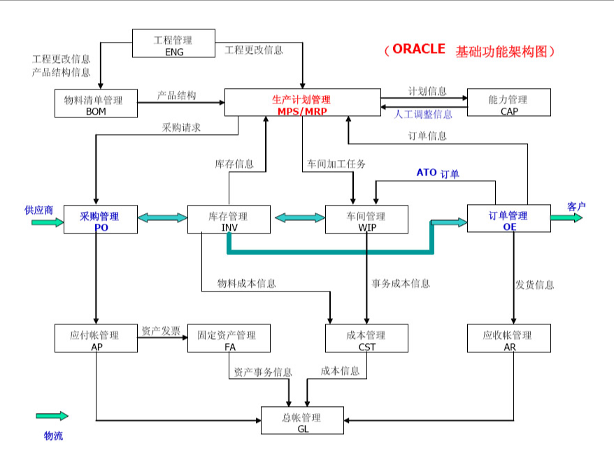

# ERP和EBS

## 1. 什么是ERP

ERP全称（Enterprise Resource Planning，企业资源计划），Oracle提供了一系列的企业资源计划软件，这些软件旨在帮助组织管理和整合各种业务流程，如财务、供应链、采购、销售、人力资源等，将一些核心构造连接到跨业务部门的工作流驱动的业务系统， 实现业务数据和财务系统的温和，将系统和系统用户连接起来，以便提高效率和效益。

各个行业中各种规模的企业都需要使用 ERP 管理系统来管理业务，ERP 是企业不可或缺的一部分。

ERP系统的好处包括：

1. 流程优化和效率提升：通过自动化和集成不同部门的流程，减少重复工作和错误，提高工作效率。
2. 数据集中和共享：所有部门使用同一套数据，减少数据冗余和不一致性，并提供准确的实时数据供决策使用。
3. 决策支持：提供详细的报表和分析功能，帮助管理层做出准确的决策。
4. 供应链管理：整合供应商和客户的信息，优化供应链流程，提高供应链的可见性和协同性。
5. 成本控制：通过更好地管理资源和流程，降低企业的运营成本。
6. 可扩展性：ERP系统可以根据企业的需求进行定制和扩展，以适应业务增长和变化。

需要指出的是，ERP系统的实施是一个复杂的过程，涉及到业务流程的重新设计、数据迁移、培训等方面。因此，企业在选择和实施ERP系统时需要认真考虑，并充分准备。

## 2. ERP和财务管理的区别

财务管理只是ERP诸多模块的一个子集， 财务管理是企业财务部门的业务职能，包括财务会计、分类帐会计、会计中心应付账款、收入管理、计费、补助、费用管理、项目管理、资产管理、合资企业会计和收款等模块。

## 3. 什么是EBS

EBS（Oracle E-Business Suite）是Oracle公司提供的一套集成的企业应用程序，EBS是在ERP基础上的扩展，涵盖了财务系统、供应链管理、人力资源管理、项目管理、销售、市场营销等领域，EBS提供了一系列的应用模块，可以根据组织的需求选择和定制特定的模块来支持其他业务流程。

Oracle EBS二次开发是指在Oracle EBS的基础上根据每个公司的具体业务需求进行二次开发。

EBS基础功能架构图：

对于一个典型的制造型企业而言，简单来说，它至少包括两个最基本的业务过程：其一是所谓“**价值增值**”过程，即买进原材料、进行加工生产出产品，再以更高的价值卖出去，这个过程通常属于“业务运营管理”范畴；其二是所谓“**价值实现**”过程，即从客户回收货款，向供应商支付购买材料的费用，再根据国家的会计法规，扣除相关费用如设备折旧等等，剩下的就是利润（或曰股东价值），这个过程通常属于“财务会计管理”范畴。

图示例中的13个模块恰好实现了对“业务运营”与“财务会计”管理这两大核心业务过程的全覆盖，符合“财务/业务一体化”的标准，是一个最小的、也是基本完整的“企业级”应用。