# Docker学习笔记

## 1. 什么是docker

Docker给我们提供一个具有隔离性、安全性的运行软件环境（容器）。相比于虚拟机，Docker更加轻量级，占用资源更少，在给定的硬件组合上可以运行更多的容器。简单点说，Docker可以像虚拟机一样，让我们在一台主机上面模拟出多个独立的运行环境，如同多台主机一样，并且比虚拟机更节省资源。 

之前的虚拟机技术：

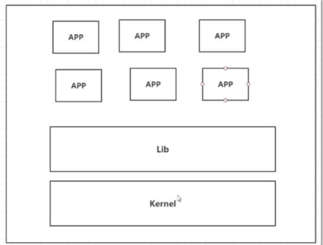

缺点：

- 资源占用十分多

- 冗余步骤多

- 启动很慢！

容器化技术：

容器化技术不是模拟一个完整的操作系统

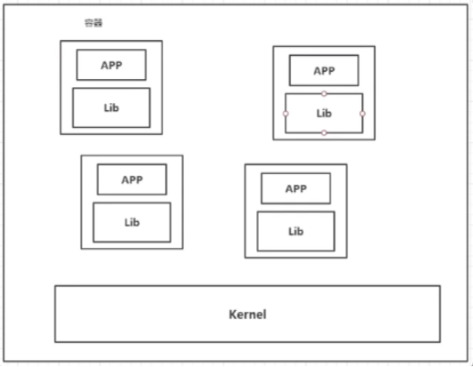

比较Docker和虚拟机技术的不同：

- 传统虚拟机，虚拟出一条硬件，运行一个完整的操作系统，然后在这个系统上安装和运行软件


- 容器内的应用直接运行在宿主机的内容，容器是没有自己的内核的，也没有虚拟我们的硬件，所以就轻便了


- 每个容器间是互相隔离，每个容器内都有一个属于自己的文件系统，互不影响

## 2. docker的安装和卸载

帮助文档：https://docs.docker.com/engine/install/

```shell
#1.卸载旧版本
yum remove docker \
                  docker-client \
                  docker-client-latest \
                  docker-common \
                  docker-latest \
                  docker-latest-logrotate \
                  docker-logrotate \
                  docker-engine
#2.需要的安装包
yum install -y yum-utils

#3.设置镜像的仓库
yum-config-manager \
    --add-repo \
    https://download.docker.com/linux/centos/docker-ce.repo
#上述方法默认是从国外的，不推荐

#推荐使用国内的
yum-config-manager \
    --add-repo \
    https://mirrors.aliyun.com/docker-ce/linux/centos/docker-ce.repo
    
#更新yum软件包索引
yum makecache fast

#4.安装docker相关的 docker-ce 社区版 而ee是企业版
yum install docker-ce docker-ce-cli containerd.io # 这里我们使用社区版即可

#5.启动docker
systemctl start docker

#6. 使用docker version查看是否按照成功
docker version

#7. 测试
docker run hello-world

#8.查看已经下载的镜像(从这里可以查看已有镜像的id)
[root@iz2zeak7sgj6i7hrb2g862z ~]# docker images
REPOSITORY            TAG                 IMAGE ID            CREATED             SIZE
hello-world           latest              bf756fb1ae65        4 months ago      13.3kB


```

卸载docker

```shell
#1. 卸载依赖
yum remove docker-ce docker-ce-cli containerd.io
#2. 删除资源
rm -rf /var/lib/docker
# /var/lib/docker 是docker的默认工作路径！
```

## 3. docker run的执行流程

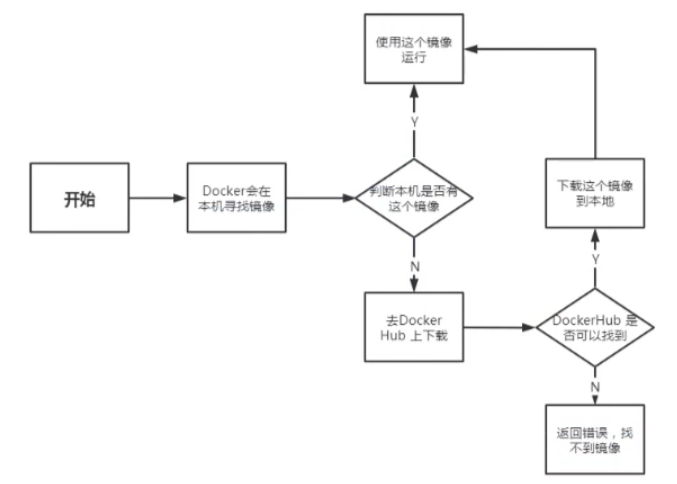

## 4. 为什么Docker比Vm快

1. docker有着比虚拟机更少的抽象层。由于docker不需要Hypervisor实现硬件资源虚拟化,运行在docker容器上的程序直接使用的都是实际物理机的硬件资源。因此在CPU、内存利用率上docker将会在效率上有明显优势。
2. docker利用的是宿主机的内核,而不需要Guest OS。

```xml
GuestOS： VM（虚拟机）里的的系统（OS）
HostOS：物理机里的系统（OS）
```

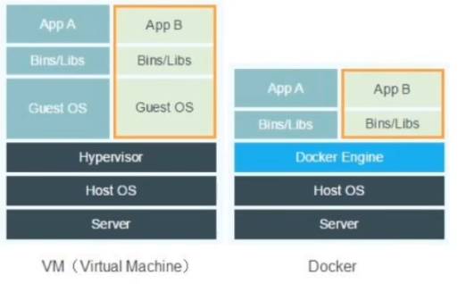

因此,当新建一个 容器时,docker不需要和虚拟机一样重新加载一个操作系统内核。仍而避免引导、加载操作系统内核返个比较费时费资源的过程,当新建一个虚拟机时,虚拟机软件需要加载GuestOS,返个新建过程是分钟级别的。而docker由于直接利用宿主机的操作系统,则省略了这个复杂的过程,因此新建一个docker容器只需要几秒钟。

## 5. docker常用命令

### 5.1 帮助命令

```shell
docker version    #显示docker的版本信息。
docker info       #显示docker的系统信息，包括镜像和容器的数量
docker 命令 --help #帮助命令
```

### 5.2 镜像命令

```shell
docker images   #查看所有本地主机上的镜像 可以使用docker image ls代替
docker search   #搜索镜像
docker pull     #下载镜像 docker image pull
docker rmi      #删除镜像 docker image rm
```

##### docker images查看所有本地的主机上的镜像

```shell
[root@iz2zeak7sgj6i7hrb2g862z ~]# docker images
REPOSITORY            TAG                 IMAGE ID            CREATED           SIZE
hello-world           latest              bf756fb1ae65        4 months ago     13.3kB
mysql                 5.7                 b84d68d0a7db        6 days ago       448MB

# 解释
#REPOSITORY			# 镜像的仓库源
#TAG				# 镜像的标签(版本)		---lastest 表示最新版本
#IMAGE ID			# 镜像的id
#CREATED			# 镜像的创建时间
#SIZE				# 镜像的大小

# 可选项
Options:
  -a, --all         Show all images (default hides intermediate images) #列出所有镜像
  -q, --quiet       Only show numeric IDs # 只显示镜像的id
  
[root@iz2zeak7sgj6i7hrb2g862z ~]# docker images -a  #列出所有镜像详细信息
[root@iz2zeak7sgj6i7hrb2g862z ~]# docker images -aq #列出所有镜像的id
d5f28a0bb0d0
f19c56ce92a8
1b6b1fe7261e
1b6b1fe7261e

```

##### docker search 搜索镜像

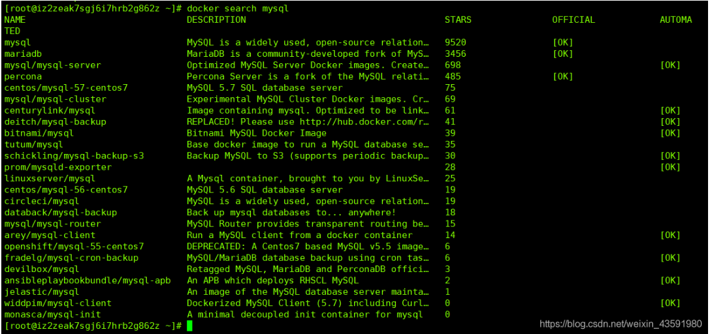

##### docker pull 下载镜像

```shell
# 下载镜像 docker pull 镜像名[:tag]
[root@iz2zeak7sgj6i7hrb2g862z ~]# docker pull tomcat:8
8: Pulling from library/tomcat #如果不写tag，默认就是latest
90fe46dd8199: Already exists   #分层下载： docker image 的核心 联合文件系统
35a4f1977689: Already exists 
bbc37f14aded: Already exists 
74e27dc593d4: Already exists 
93a01fbfad7f: Already exists 
1478df405869: Pull complete 
64f0dd11682b: Pull complete 
68ff4e050d11: Pull complete 
f576086003cf: Pull complete 
3b72593ce10e: Pull complete 
Digest: sha256:0c6234e7ec9d10ab32c06423ab829b32e3183ba5bf2620ee66de866df # 签名防伪
Status: Downloaded newer image for tomcat:8
docker.io/library/tomcat:8 #真实地址

#等价于
docker pull tomcat:8
docker pull docker.io/library/tomcat:8
```

##### docker rmi 删除镜像

```shell
docker rmi -f 镜像id #删除指定id的镜像
[root@iz2zeak7sgj6i7hrb2g862z ~]# docker rmi -f f19c56ce92a8

docker rmi -f $(docker images -aq) #删除全部的镜像
[root@iz2zeak7sgj6i7hrb2g862z ~]# docker stop $(docker ps -a -q)
```

### 5.3 容器命令

说明：我们有了镜像才可以创建容器，Linux，下载centos镜像来学习

##### 镜像下载

```shell
#docker中下载centos
docker pull centos

docker run 镜像id #新建容器并启动

docker ps 列出所有运行的容器 docker container list

docker rm 容器id #删除指定容器

docker start 容器id	#启动容器
docker restart 容器id	#重启容器
docker stop 容器id	#停止当前正在运行的容器
docker kill 容器id	#强制停止当前容器
```

##### 新建容器并启动

```shell
docker run [可选参数] image | docker container run [可选参数] image 
# 参数说明
--name="Name"		#容器名字 tomcat01 tomcat02 用来区分容器
-d					#后台方式运行
-it 				#使用交互方式运行，进入容器查看内容
-p					#指定容器的端口 -p 8080(宿主机):8080(容器)
		-p ip:主机端口:容器端口
		-p 主机端口:容器端口(常用)
		-p 容器端口
		容器端口
-P(大写) 				随机指定端口

# 测试、启动并进入容器
[root@iz2zeak7sgj6i7hrb2g
[root@iz2zeak7sgj6i7hrb2g862z ~]# docker run -it centos /bin/bash
[root@241b5abce65e /]# ls
bin  dev  etc  home  lib  lib64  lost+found  media  mnt  opt  proc  root  run  sbin  srv  sys  tmp  usr  var
[root@241b5abce65e /]# exit #从容器退回主机
exit
```

##### 列出所有运行的容器

```shell
docker ps 命令  		#列出当前正在运行的容器
  -a, --all     	 #列出当前正在运行的容器 + 带出历史运行过的容器
  -n=?, --last int   #列出最近创建的?个容器 ?为1则只列出最近创建的一个容器,为2则列出2个
  -q, --quiet        #只列出容器的编号
```

##### 退出容器

```shell
exit 		#容器直接退出
ctrl +P +Q  #容器不停止退出 	---注意：这个很有用的操作
```

##### 删除容器

```shell
docker rm 容器id   				#删除指定的容器，不能删除正在运行的容器，如果要强制删除 rm -rf
docker rm -f $(docker ps -aq)  	 #删除所有的容器
docker ps -a -q|xargs docker rm  #删除所有的容器
```

##### 启动和停止容器的操作

```shell
docker start 容器id	#启动容器
docker restart 容器id	#重启容器
docker stop 容器id	#停止当前正在运行的容器
docker kill 容器id	#强制停止当前容器
```

### 5.4 常用其他命令

**后台启动容器**

```shell
# 命令 docker run -d 镜像名
[root@iZ2zeg4ytp0whqtmxbsqiiZ /]# docker run -d centos
 
# 问题 docker ps， 发现centos停止了
 
# 常见的坑， docker 容器使用后台运行， 就必须要有一个前台进程，docker发现没有应用，就会自动停止
# nginx， 容器启动后，发现自己没有提供服务，就会立即停止，就是没有程序了
```

**查看日志**

```shell
docker logs -tf --tail number 容器id
 
[root@iZ2zeg4ytp0whqtmxbsqiiZ /]# docker logs -tf --tail 1 8d1621e09bff
2020-08-11T10:53:15.987702897Z [root@8d1621e09bff /]# exit      # 日志输出
 
# 自己编写一段shell脚本
[root@iZ2zeg4ytp0whqtmxbsqiiZ /]# docker run -d centos /bin/sh -c "while true;do echo xiaofan;sleep 1;done"
a0d580a21251da97bc050763cf2d5692a455c228fa2a711c3609872008e654c2
 
[root@iZ2zeg4ytp0whqtmxbsqiiZ /]# docker ps
CONTAINER ID        IMAGE               COMMAND                  CREATED             STATUS              PORTS               NAMES
a0d580a21251        centos              "/bin/sh -c 'while t…"   3 seconds ago       Up 1 second                             lucid_black
 
# 显示日志
-tf                 # 显示日志
--tail number       # 显示日志条数
[root@iZ2zeg4ytp0whqtmxbsqiiZ /]# docker logs -tf --tail 10 a0d580a21251
```

**查看容器中的进程信息ps**

```shell
docker top 容器id

# 命令 docker top 容器id
[root@iZ2zeg4ytp0whqtmxbsqiiZ /]# docker top df358bc06b17
UID                 PID                 PPID                C                   STIME               TTY     
root                28498               28482               0                   19:38               ?      
```

**查看镜像的元数据**

```shell
# 命令
docker inspect 容器id
 
[root@iZ2zeg4ytp0whqtmxbsqiiZ /]# docker inspect df358bc06b17
[
    {
        "Id": "df358bc06b17ef44f215d35d9f46336b28981853069a3739edfc6bd400f99bf3",
        "Created": "2020-08-11T11:38:34.935048603Z",
        "Path": "/bin/bash",
        "Args": [],
        "State": {
            "Status": "running",
            "Running": true,
            "Paused": false,
            "Restarting": false,
            "OOMKilled": false,
            "Dead": false,
            "Pid": 28498,
            "ExitCode": 0,
            "Error": "",
            "StartedAt": "2020-08-11T11:38:35.216616071Z",
            "FinishedAt": "0001-01-01T00:00:00Z"
        },
        "Image": "sha256:0d120b6ccaa8c5e149176798b3501d4dd1885f961922497cd0abef155c869566",
        "ResolvConfPath": "/var/lib/docker/containers/df358bc06b17ef44f215d35d9f46336b28981853069a3739edfc6bd400f99bf3/resolv.conf",
        "HostnamePath": "/var/lib/docker/containers/df358bc06b17ef44f215d35d9f46336b28981853069a3739edfc6bd400f99bf3/hostname",
        "HostsPath": "/var/lib/docker/containers/df358bc06b17ef44f215d35d9f46336b28981853069a3739edfc6bd400f99bf3/hosts",
        "LogPath": "/var/lib/docker/containers/df358bc06b17ef44f215d35d9f46336b28981853069a3739edfc6bd400f99bf3/df358bc06b17ef44f215d35d9f46336b28981853069a3739edfc6bd400f99bf3-json.log",
        "Name": "/hungry_heisenberg",
        "RestartCount": 0,
        "Driver": "overlay2",
        "Platform": "linux",
        "MountLabel": "",
        "ProcessLabel": "",
        "AppArmorProfile": "",
        "ExecIDs": null,
        "HostConfig": {
            "Binds": null,
            "ContainerIDFile": "",
            "LogConfig": {
                "Type": "json-file",
                "Config": {}
            },
            "NetworkMode": "default",
            "PortBindings": {},
            "RestartPolicy": {
                "Name": "no",
                "MaximumRetryCount": 0
            },
            "AutoRemove": false,
            "VolumeDriver": "",
            "VolumesFrom": null,
            "CapAdd": null,
            "CapDrop": null,
            "Capabilities": null,
            "Dns": [],
            "DnsOptions": [],
            "DnsSearch": [],
            "ExtraHosts": null,
            "GroupAdd": null,
            "IpcMode": "private",
            "Cgroup": "",
            "Links": null,
            "OomScoreAdj": 0,
            "PidMode": "",
            "Privileged": false,
            "PublishAllPorts": false,
            "ReadonlyRootfs": false,
            "SecurityOpt": null,
            "UTSMode": "",
            "UsernsMode": "",
            "ShmSize": 67108864,
            "Runtime": "runc",
            "ConsoleSize": [
                0,
                0
            ],
            "Isolation": "",
            "CpuShares": 0,
            "Memory": 0,
            "NanoCpus": 0,
            "CgroupParent": "",
            "BlkioWeight": 0,
            "BlkioWeightDevice": [],
            "BlkioDeviceReadBps": null,
            "BlkioDeviceWriteBps": null,
            "BlkioDeviceReadIOps": null,
            "BlkioDeviceWriteIOps": null,
            "CpuPeriod": 0,
            "CpuQuota": 0,
            "CpuRealtimePeriod": 0,
            "CpuRealtimeRuntime": 0,
            "CpusetCpus": "",
            "CpusetMems": "",
            "Devices": [],
            "DeviceCgroupRules": null,
            "DeviceRequests": null,
            "KernelMemory": 0,
            "KernelMemoryTCP": 0,
            "MemoryReservation": 0,
            "MemorySwap": 0,
            "MemorySwappiness": null,
            "OomKillDisable": false,
            "PidsLimit": null,
            "Ulimits": null,
            "CpuCount": 0,
            "CpuPercent": 0,
            "IOMaximumIOps": 0,
            "IOMaximumBandwidth": 0,
            "MaskedPaths": [
                "/proc/asound",
                "/proc/acpi",
                "/proc/kcore",
                "/proc/keys",
                "/proc/latency_stats",
                "/proc/timer_list",
                "/proc/timer_stats",
                "/proc/sched_debug",
                "/proc/scsi",
                "/sys/firmware"
            ],
            "ReadonlyPaths": [
                "/proc/bus",
                "/proc/fs",
                "/proc/irq",
                "/proc/sys",
                "/proc/sysrq-trigger"
            ]
        },
        "GraphDriver": {
            "Data": {
                "LowerDir": "/var/lib/docker/overlay2/5af8a2aadbdba9e1e066331ff4bce56398617710a22ef906f9ce4d58bde2d360-init/diff:/var/lib/docker/overlay2/62926d498bd9d1a6684bb2f9920fb77a2f88896098e66ef93c4b74fcb19f29b6/diff",
                "MergedDir": "/var/lib/docker/overlay2/5af8a2aadbdba9e1e066331ff4bce56398617710a22ef906f9ce4d58bde2d360/merged",
                "UpperDir": "/var/lib/docker/overlay2/5af8a2aadbdba9e1e066331ff4bce56398617710a22ef906f9ce4d58bde2d360/diff",
                "WorkDir": "/var/lib/docker/overlay2/5af8a2aadbdba9e1e066331ff4bce56398617710a22ef906f9ce4d58bde2d360/work"
            },
            "Name": "overlay2"
        },
        "Mounts": [],
        "Config": {
            "Hostname": "df358bc06b17",
            "Domainname": "",
            "User": "",
            "AttachStdin": true,
            "AttachStdout": true,
            "AttachStderr": true,
            "Tty": true,
            "OpenStdin": true,
            "StdinOnce": true,
            "Env": [
                "PATH=/usr/local/sbin:/usr/local/bin:/usr/sbin:/usr/bin:/sbin:/bin"
            ],
            "Cmd": [
                "/bin/bash"
            ],
            "Image": "centos",
            "Volumes": null,
            "WorkingDir": "",
            "Entrypoint": null,
            "OnBuild": null,
            "Labels": {
                "org.label-schema.build-date": "20200809",
                "org.label-schema.license": "GPLv2",
                "org.label-schema.name": "CentOS Base Image",
                "org.label-schema.schema-version": "1.0",
                "org.label-schema.vendor": "CentOS"
            }
        },
        "NetworkSettings": {
            "Bridge": "",
            "SandboxID": "4822f9ac2058e8415ebefbfa73f05424fe20cc8280a5720ad3708fa6e80cdb08",
            "HairpinMode": false,
            "LinkLocalIPv6Address": "",
            "LinkLocalIPv6PrefixLen": 0,
            "Ports": {},
            "SandboxKey": "/var/run/docker/netns/4822f9ac2058",
            "SecondaryIPAddresses": null,
            "SecondaryIPv6Addresses": null,
            "EndpointID": "5fd269c0a28227241e40cd30658e3ffe8ad6cc3e6514917c867d89d36a31d605",
            "Gateway": "172.17.0.1",
            "GlobalIPv6Address": "",
            "GlobalIPv6PrefixLen": 0,
            "IPAddress": "172.17.0.2",
            "IPPrefixLen": 16,
            "IPv6Gateway": "",
            "MacAddress": "02:42:ac:11:00:02",
            "Networks": {
                "bridge": {
                    "IPAMConfig": null,
                    "Links": null,
                    "Aliases": null,
                    "NetworkID": "30d6017888627cb565618b1639fecf8fc97e1ae4df5a9fd5ddb046d8fb02b565",
                    "EndpointID": "5fd269c0a28227241e40cd30658e3ffe8ad6cc3e6514917c867d89d36a31d605",
                    "Gateway": "172.17.0.1",
                    "IPAddress": "172.17.0.2",
                    "IPPrefixLen": 16,
                    "IPv6Gateway": "",
                    "GlobalIPv6Address": "",
                    "GlobalIPv6PrefixLen": 0,
                    "MacAddress": "02:42:ac:11:00:02",
                    "DriverOpts": null
                }
            }
        }
    }
]
 
```

**进入正在进行的容器**

容器通常都是使用后台的方式运行的，进入运行的容器

```shell
# 命令
docker exec -it 容器id bashShell

# 我们通常容器使用后台方式运行的， 需要进入容器，修改一些配置
 
# 测试
[root@centos100 /]# docker exec -it df358bc06b17 /bin/bash
[root@df358bc06b17 /]# ls       
bin  etc   lib    lost+found  mnt  proc  run   srv  tmp  var
dev  home  lib64  media       opt  root  sbin  sys  usr
[root@df358bc06b17 /]# ps -ef
UID        PID  PPID  C STIME TTY          TIME CMD
root         1     0  0 Aug11 pts/0    00:00:00 /bin/bash
root        29     0  0 01:06 pts/1    00:00:00 /bin/bash
root        43    29  0 01:06 pts/1    00:00:00 ps -ef
 
# 方式二
docker attach 容器id
 
# docker exec       # 进入容器后开启一个新的终端，可以在里面操作
# docker attach     # 进入容器正在执行的终端，不会启动新的进程
```

**从容器内拷贝文件到主机上**

docker cp 容器id:容器内的路径  目的主机的路径

```shell
# 容器内的centos
[root@bf34baad3e62 ~]# cd /home
[root@bf34baad3e62 home]# ls
[root@bf34baad3e62 home]# touch test.java
[root@bf34baad3e62 home]# ls
test.java
[root@bf34baad3e62 home]# exit
exit

[root@centos100 ~]# docker ps
CONTAINER ID   IMAGE     COMMAND   CREATED   STATUS    PORTS     NAMES
[root@centos100 ~]# docker ps -a
CONTAINER ID   IMAGE     COMMAND       CREATED          STATUS                      PORTS     NAMES
bf34baad3e62   centos    "/bin/bash"   2 minutes ago    Exited (0) 6 seconds ago              flamboyant_cori
d2d8a4cf3586   centos    "/bin/bash"   3 minutes ago    Exited (0) 3 minutes ago              exciting_dirac
4117e05921a0   centos    "/bin/bash"   55 minutes ago   Exited (0) 55 minutes ago             pensive_mendel

#复制到本机上
[root@centos100 ~]# docker cp bf34baad3e62:/home/test.java /home
Successfully copied 1.54kB to /home
[root@centos100 ~]# cd /home
[root@centos100 home]# ls
test.java

```

拷贝是一个手动的过程，将来我们使用 -v 卷（数据卷）的技术，可以实现自动同步

##  6. 练习

### docker安装部署nginx

1. 搜索镜像   search    建议到docker hub上搜索

2. 下载镜像  pull

3. 运行测试

   ```shell
   # -d 后台运行
   # -name 给容器起名字
   # -p 暴露端口   宿主机的端口：容器内部端口
   [root@centos100 home]# docker run -d --name nginx01 -p 3344:80 nginx
   e6262a393f58b201c164d266cd77c0acdc8ee5c57e7b1eb4132a170472fc94d7
   [root@centos100 home]# docker ps 
   CONTAINER ID   IMAGE     COMMAND                   CREATED         STATUS         PORTS                                   NAMES
   e6262a393f58   nginx     "/docker-entrypoint.…"   8 seconds ago   Up 7 seconds   0.0.0.0:3344->80/tcp, :::3344->80/tcp   nginx01
   [root@centos100 home]# curl localhost:3344
   <!DOCTYPE html>
   <html>
   <head>
   <title>Welcome to nginx!</title>
   <style>
   html { color-scheme: light dark; }
   body { width: 35em; margin: 0 auto;
   font-family: Tahoma, Verdana, Arial, sans-serif; }
   </style>
   </head>
   <body>
   <h1>Welcome to nginx!</h1>
   <p>If you see this page, the nginx web server is successfully installed and
   working. Further configuration is required.</p>
   
   <p>For online documentation and support please refer to
   <a href="http://nginx.org/">nginx.org</a>.<br/>
   Commercial support is available at
   <a href="http://nginx.com/">nginx.com</a>.</p>
   
   <p><em>Thank you for using nginx.</em></p>
   </body>
   
   ```

   端口暴露的概念

   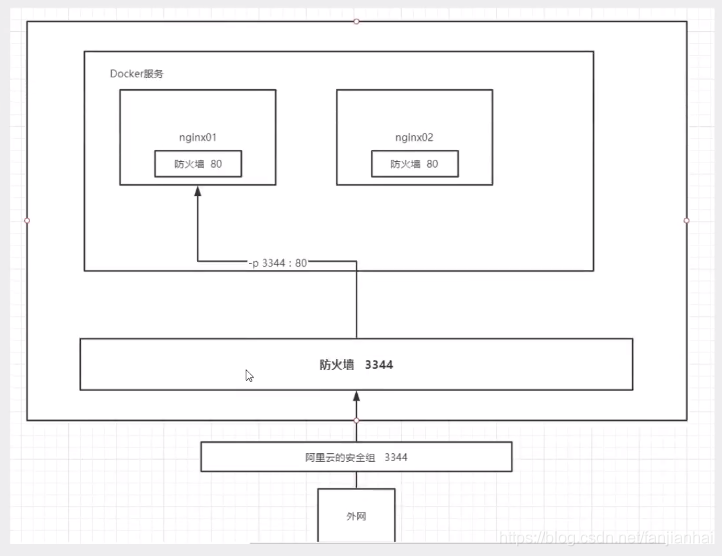

部署后可以通过http://192.168.109.100:3344/来访问


### docker安装部署tomcat

搜索镜像

安装镜像

启动运行

### docker安装tomcat

```shell
# 官方的使用
docker run -it --rm tomcat:9.0
 
# 我们之前的启动都是后台的，停止了容器之后， 容器还是可以查到，docker run -it --rm 一般用来测试，用完就删
 
# 下载再启动
docker pull tomcat
 
# 启动运行
docker run -d -p 3355:8080 --name tomcat01 tomcat
 
# 测试访问没有问题
 
# 进入容器
docker exec -it tomcat01 /bin/bash
 
# 发现问题：1.linux命令少了， 2. webapps下内容为空，阿里云净吸纳过默认是最小的镜像，所有不必要的都剔除了，保证最小可运行环境即可

我们可以进入容器后，将webapps.dist中的文件复制到webapps里，然后关闭防火墙。就可以通过本机访问了

```

## 7. Docker镜像原理

UnionFS 联合文件系统是一种分层、轻量级并且高性能的文件系统，它支持对文件系统的修改，作为一次提交来一层层的叠加，同时可以将不同目录挂在到同一个虚拟文件系统下。


docker镜像加载

- 实际上由一层一层的文件系统（UnionFs）组成
- bootfs：BootLoader + kernel，BootLoader主要是引导kernel
- rootfs：bootfs之上。

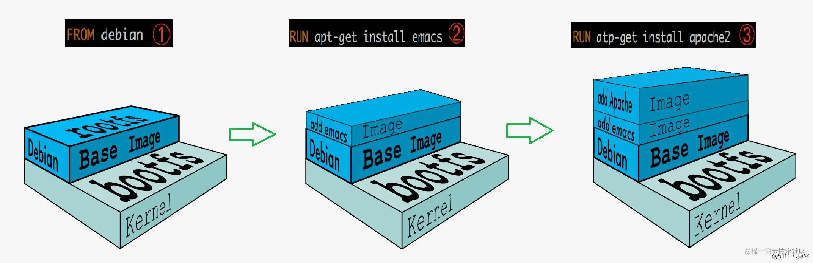

doker的镜像都是只读的，当容器启动时，一个新的可写层被加载到镜像的顶部，这就是我们通常说的容器层，容器层之下的都叫做镜像层。

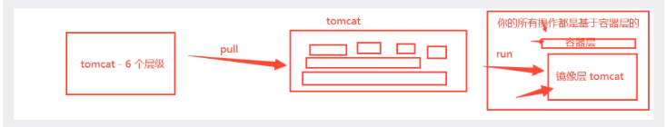

## 8. commit镜像

```shell
docker commit 提交容器成为一个新的版本
docker commit -m="提交的描述信息" -a="作者" 容器id 目标镜像名
```

将我们自己的容器通过commit提交到一个镜像，以后我们用自己的镜像就可以了。

## 9. 容器数据卷

什么是容器数据卷

docker就是将应用和环境打包成一个镜像。如果数据都在容器中，如果我们将容器删除，数据就会丢失。为了解决这个问题，就产生了docker数据卷，就是让容器中的数据可以持久化和同步，容器间的数据共享。其实就是目录的挂在，将我们容器中的目录，挂在到Linux上。


### 使用数据卷

#### 方式一：直接使用命令来挂载  -v

```shell
docker run -it -v 主机目录：容器内目录

docker run -it -v /home/ceshi:/home centos /bin/bash

```

启动之后，可以通过`docker inspect 容器id`查看是否挂在成功。


同步的过程，双向绑定，测试文件的同步


再来测试

1. 停止容器
2. 在宿主主机上修改文件
3. 启动容器
4. 容器内的数据依旧是同步的


好处：以后修改只需要在本地修改即可，容器内会自动同步。

### 实战：安装Mysql

思考：Mysql的数据持久化的问题

获取镜像

```shell
docker pull mysql:5.7
```

运行容器时进行数据挂载

```shell
# 安装mysql需要配置密码的！！！
# 官方测试: docker -run --name some-mysql -e MYSQL_ROOT_PASSWORD=my-secret-pw -d mysql:tag

-d 后台运行
-p 暴露端口 端口映射
-v 卷挂载
-e 环境配置
--name  容器名字

docker run -d -p 3310:3306 -v /home/mysql/conf:/etc/mysql/conf.d -v /home/mysql/data:/var/lib/mysql -e MYSQL_ROOT_PASSWORD=123456 --name mysql01 mysql:5.7
```

用navicat进行远程测试，记得关闭防火墙，打开ssh连接

遇到的的问题：

启动时报错:

```shell
[ERROR] InnoDB: Write to file ./ibdata1 failed at offset 0, 1048576 bytes should have been written, only 0 were written. Operating system error number 28. Check that your OS and file system support files of this size. Check also that the disk is not full or a disk quota exceeded.
[ERROR] InnoDB: Error number 28 means 'No space left on device'
[ERROR] InnoDB: Could not set the file size of './ibdata1'. Probably out of disk space
[ERROR] InnoDB: InnoDB Database creation was aborted with error Generic error. You may need to delete the ibdata1 file before trying to start up again.
```

根据错误消息，问题可能是由于磁盘空间不足引起的。InnoDB存储引擎无法写入数据库文件（`ibdata1`）并报告 "No space left on device" 错误。

要清理根文件系统上的不需要文件以释放磁盘空间，可以执行以下操作：

1. **查找大文件**：首先，通过使用 `du` 命令来查找占用较大空间的文件和目录。运行以下命令以按照文件大小的递减顺序列出文件和目录的大小：

   ```
   du -h --max-depth=1 / | sort -hr
   ```
   
   这将列出根文件系统中的文件和目录，按照大小的递减顺序显示。你可以查看列表并找出占用较大空间的文件或目录。
   
2. **删除不需要的文件**：根据上一步中找到的大文件或目录，确定哪些是不再需要的文件。使用 `rm` 命令来删除不需要的文件。请注意，在删除文件之前，确保你确定这些文件不再需要，并且它们不会对系统或应用程序造成影响。例如，可以使用以下命令删除单个文件：

   ```
   bashCopy code
   rm /path/to/file
   ```

   或者，如果要删除整个目录及其内容，请使用以下命令（谨慎使用）：

   ```
   bashCopy code
   rm -rf /path/to/directory
   ```

   请注意，`rm -rf` 命令会无条件地删除目录及其内容，因此请确保你删除的是正确的目录。

3. **清理日志文件**：另一个常见的空间占用问题是日志文件。检查 `/var/log/` 目录中的日志文件，并删除不再需要的日志文件。你可以使用以下命令来删除日志文件：

   ```
   bashCopy code
   rm /var/log/file.log
   ```

   或者，如果要删除整个目录中的日志文件，请使用以下命令（谨慎使用）：

   ```
   bashCopy code
   rm -rf /var/log/directory
   ```

   请确保你只删除不再需要的日志文件。

通过执行这些操作，你应该能够释放一些根文件系统的磁盘空间。请注意，清理文件时要小心，确保你只删除不再需要的文件，并且不会对系统或应用程序造成影响。


最后删除了/home/mysql目录，重新运行容器，成功！！！


### 具名挂载和匿名挂载

```shell
# 匿名挂载
-v 容器内路径！       -v 后直接写容器内路径
docker run -d -p --name nginx01 -v /etc/nginx nginx

# 查看所有卷的情况
docker volume ls

# 这里发现，这种就是匿名挂载，我们在 -v 只写了容器内的路径，没有写容器外的路径！

# 具名挂载
a2006ca23ff80dd99855f53ae239f1e9b1ee070079bda2d03ade21be3bbd863d
root@VM-12-13-centos  /  docker run -d -P --name nginx002 -v juming-nginx:/etc/nginx nginx
6950de23be75a77fb315ea738a4b448bcd0618326fdcec7aabd4e54e9e3c4d59
 ⚡ root@VM-12-13-centos  /  docker volume ls                                                 
DRIVER    VOLUME NAME
local     juming-nginx

# 通过 -v 卷名:容器内路径
# 查看卷名所在位置
⚡ root@VM-12-13-centos  /  docker volume inspect juming-nginx
[
    {
        "CreatedAt": "2022-11-17T16:33:24+08:00",
        "Driver": "local",
        "Labels": null,
        "Mountpoint": "/var/lib/docker/volumes/juming-nginx/_data",
        "Name": "juming-nginx",
        "Options": null,
        "Scope": "local"
    }
]


```

所有的docker容器内的卷，没有指定目录的情况下都是在`/var/lib/docker/volumes/_data`

通过具名挂载可以方便我们找到这个卷。大多数情况使用具名挂载

```shell
如何确定是具名挂载还是匿名挂载，还是指定路径挂载！

-v 容器内路径 		 # 匿名挂载
-v 卷名:容器内路径		# 具名挂载
-v /宿主机路径:容器内路径  # 指定路径挂
```


拓展

```shell
# 通过 -v 容器内路径:ro  rw可以改变我们的读写权限

ro  readonly  # 只读
rw  readwrite  # 可读可写 (默认)

#一旦设定这个容器的权限，容器对我们挂载出来的内容就是有权限了！

docker run -d -P --name nginx02 -v juming-nginx:/etc/nginx:ro nginx
docker run -d -P --name nginx02 -v juming-nginx:/etc/nginx:rw nginx

# ro 只要看见ro就说明这个路径只能通过宿主机操作，容器内部是无法操作！
```

### 初识DockerFile

DockerFile就是用来构建docker镜像的构造文件！  其实是一个命令脚本

通过这个脚本可以生成镜像，镜像是一层一层的，脚本一个个的命令，每个命令都是一层。

#### 方式二：创建dockerfile文件挂载

```shell
# 创建一个dockerfile文件，名字可以随机，建议Dockerfile
# 文件中的内容  指令（大写） 参数

FROM centos

VOLUME ["volume01","volume02"]

CMD echo "---end---"
CMD /bin/bash


# 这里的每个命令都是镜像的一层。

docker build -f dockerfile1 -t wangfei/centos .
```

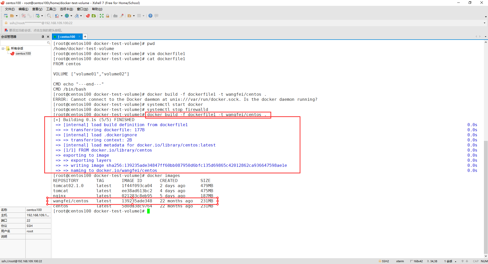

启动我们自己的镜像

```shell
docker run -it 容器id /bin/bash
```

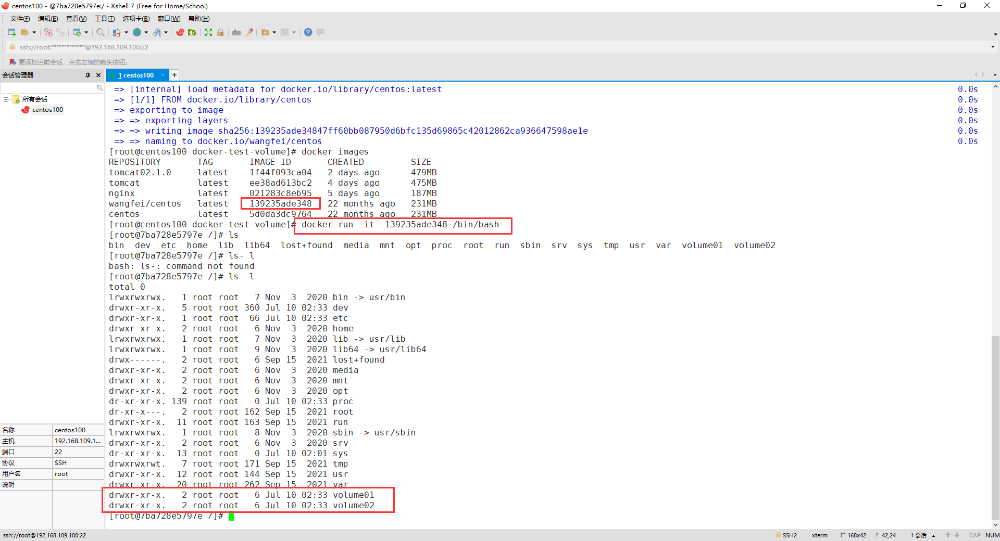

这两个目录一定与宿主机的目录有挂载，通过`docker inspect 容器id`命令，查看Mounts下的挂在情况。

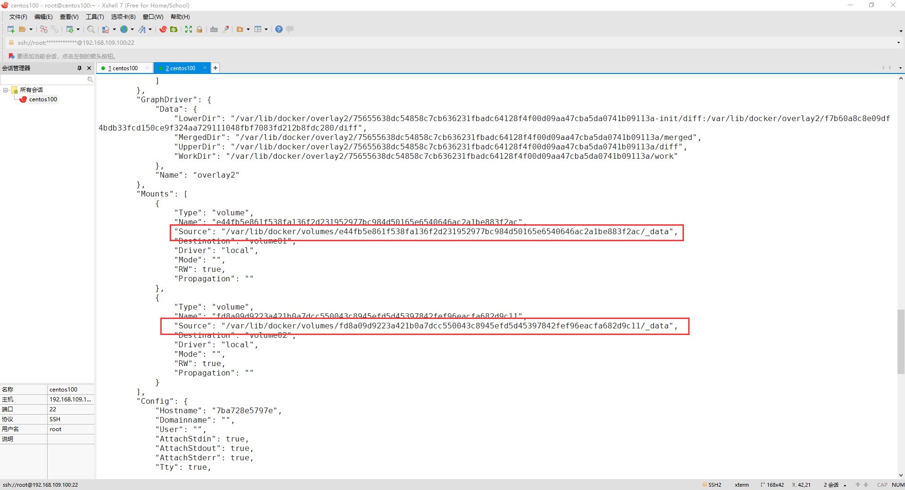


这种方式未来使用的很多，因为我们通常会构建自己的镜像。

假设构建镜像时没有挂载卷，要手动镜像挂载，-v卷名:容器内路径！


### 数据卷容器


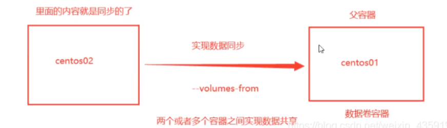

- 父容器：A去挂载B，那么B就是A的父容器
- 数据卷容器：被挂载的容器

测试：

```shell
#1. 测试 启动3个容器，通过刚才自己写的镜像启动
# 启动第一个centos，注意版本如果不写默认是找最新版
[root@centos100 ~] docker run -it --name docker01 139235ade348
[root@380f29a8d432 /]# ls -al
total 0
drwxr-xr-x.   1 root root  38 Jul 10 03:04 .
drwxr-xr-x.   1 root root  38 Jul 10 03:04 ..
-rwxr-xr-x.   1 root root   0 Jul 10 03:04 .dockerenv
lrwxrwxrwx.   1 root root   7 Nov  3  2020 bin -> usr/bin
drwxr-xr-x.   5 root root 360 Jul 10 03:04 dev
drwxr-xr-x.   1 root root  66 Jul 10 03:04 etc
drwxr-xr-x.   2 root root   6 Nov  3  2020 home
lrwxrwxrwx.   1 root root   7 Nov  3  2020 lib -> usr/lib
lrwxrwxrwx.   1 root root   9 Nov  3  2020 lib64 -> usr/lib64
drwx------.   2 root root   6 Sep 15  2021 lost+found
drwxr-xr-x.   2 root root   6 Nov  3  2020 media
drwxr-xr-x.   2 root root   6 Nov  3  2020 mnt
drwxr-xr-x.   2 root root   6 Nov  3  2020 opt
dr-xr-xr-x. 144 root root   0 Jul 10 03:04 proc
dr-xr-x---.   2 root root 162 Sep 15  2021 root
drwxr-xr-x.  11 root root 163 Sep 15  2021 run
lrwxrwxrwx.   1 root root   8 Nov  3  2020 sbin -> usr/sbin
drwxr-xr-x.   2 root root   6 Nov  3  2020 srv
dr-xr-xr-x.  13 root root   0 Jul 10 02:01 sys
drwxrwxrwt.   7 root root 171 Sep 15  2021 tmp
drwxr-xr-x.  12 root root 144 Sep 15  2021 usr
drwxr-xr-x.  20 root root 262 Sep 15  2021 var

# 容器数据卷在此
drwxr-xr-x.   2 root root   6 Jul 10 03:04 volume01
drwxr-xr-x.   2 root root   6 Jul 10 03:04 volume02

#2. ctrl+p+q退出容器

#3. 创建第二个容器docker02，继承docker01
[root@centos100 ~] docker run -it --name docker02 --volumes-from docker01 139235ade348
[root@df65778c4fb2 /]# ls -l
total 0
lrwxrwxrwx.   1 root root   7 Nov  3  2020 bin -> usr/bin
drwxr-xr-x.   5 root root 360 Jul 10 03:09 dev
drwxr-xr-x.   1 root root  66 Jul 10 03:09 etc
drwxr-xr-x.   2 root root   6 Nov  3  2020 home
lrwxrwxrwx.   1 root root   7 Nov  3  2020 lib -> usr/lib
lrwxrwxrwx.   1 root root   9 Nov  3  2020 lib64 -> usr/lib64
drwx------.   2 root root   6 Sep 15  2021 lost+found
drwxr-xr-x.   2 root root   6 Nov  3  2020 media
drwxr-xr-x.   2 root root   6 Nov  3  2020 mnt
drwxr-xr-x.   2 root root   6 Nov  3  2020 opt
dr-xr-xr-x. 150 root root   0 Jul 10 03:09 proc
dr-xr-x---.   2 root root 162 Sep 15  2021 root
drwxr-xr-x.  11 root root 163 Sep 15  2021 run
lrwxrwxrwx.   1 root root   8 Nov  3  2020 sbin -> usr/sbin
drwxr-xr-x.   2 root root   6 Nov  3  2020 srv
dr-xr-xr-x.  13 root root   0 Jul 10 02:01 sys
drwxrwxrwt.   7 root root 171 Sep 15  2021 tmp
drwxr-xr-x.  12 root root 144 Sep 15  2021 usr
drwxr-xr-x.  20 root root 262 Sep 15  2021 var
# 容器docker02继承了dockers01
drwxr-xr-x.   2 root root   6 Jul 10 03:04 volume01
drwxr-xr-x.   2 root root   6 Jul 10 03:04 volume02


#4. 在docker01中的volume01中创建文件，然后在docker02中的volume01中查看，如下图
```

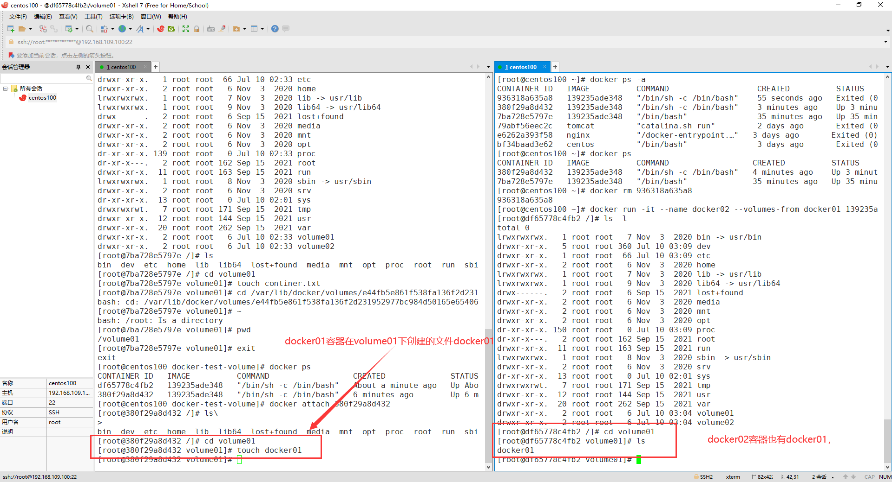

我们再创建第三个容器，挂载到第一个容器上，再创建一个docker03文件，发现docker01、dockers02都有该文件。

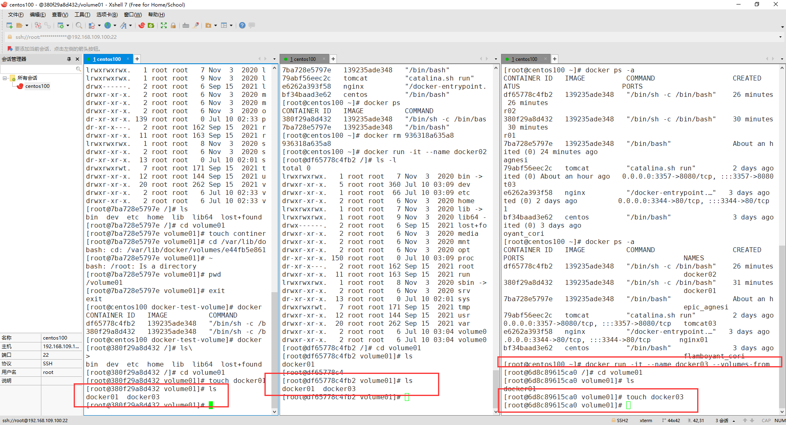

多个mysql实现数据共享

````shell
[root@iZ2zeg4ytp0whqtmxbsqiiZ home]# docker run -d -p 3344:3306 -v /etc/mysql/conf.d -v /var/lib/mysql -e MYSQL_ROOT_PASSWORD=123456 --name mysql01 mysql:5.7
 
[root@iZ2zeg4ytp0whqtmxbsqiiZ home]# docker run -d -p 3344:3306 -v /etc/mysql/conf.d -v /var/lib/mysql -e MYSQL_ROOT_PASSWORD=123456 --name mysql02 --volumes-from mysql01 mysql:5.7
````


结论：

容器之间配置信息的传递，数据卷容器的生命周期一直持续到没有容器为止。

但是一旦持久化到了本地，本地的数据时不会删除的。

## 10. DockerFile

dockerfile是用来构建docker镜像的文件。命令参数脚本！

构建步骤：

1. 编写一个dockerfile文件
2. docker build 构建成为一个镜像
3. docker run 运行容器
4. docker push 发布镜像(DockerHub、阿里云镜像仓库)

官方仓库搜索：https://hub.docker.com/_/centos


基础知识：

- 每个关键字（指令）必须是大写
- 执行从上到下顺序执行
- `#`表示注释
- 每个指令都会创建一个新的镜像层

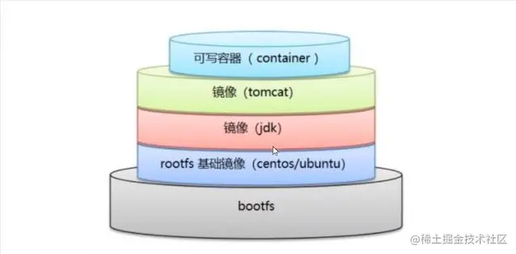


dockerfile是面向开发的，我们以后要发布项目，做镜像就需要编写dockerfile文件，这个文件十分简单。


```shell
FROM        #指定基础镜像
MAINTAINER  #镜像是谁写的，一般是加上姓名和邮箱
RUN         #docker镜像构建的时候需要运行的命令
ADD         #往镜像中添加内容
WORKDIR     #镜像的工作目录
VOLUME      #挂载的目录位置
EXPOSE      #保留端口配置
CMD         #指定这个容器启动的时候要运行的命令，只有最后一个会生效
ENTRYPOINT  #指定这个容器启动的时候要运行的命令，可以追加命令
ONBUILD     #当构建一个被继承dockerfile这个时候就会运行ONBUILD指令
COPY        #类似add，将我们的文件拷贝到镜像中
ENV         #构建的时候设置环境变量
```

### 实战测试

Docker Hub中99%镜像都是从这个基础镜像过来的FROM scratch，然后配置需要的软件和配置来进行的构建

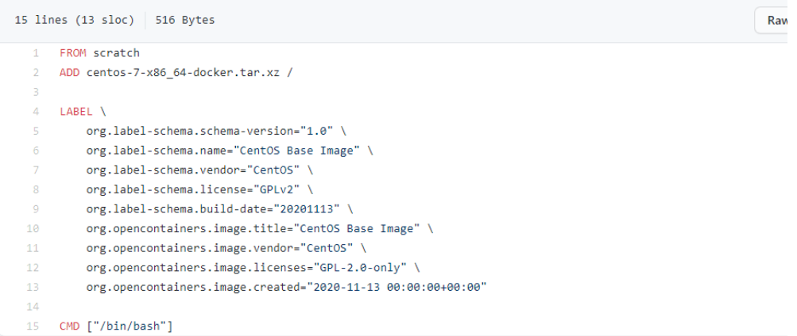

### 创建一个自己的centos

1. 创建工作目录

```shell
[root@192 dockerfile]# pwd
/home/dockerfile
[root@192 dockerfile]# vim centos-dockerfile
```

2.  编写Dockerfile的文件

```shell
[root@centos100 dockerfile]# cat mydockerfile 
FROM centos:7
MAINTAINER wangfei<1583729316@qq.com>

ENV MYPATH /user/local
WORKDIR $MYPATH

RUN yum -y install vim
RUN yum -y install net-tools

EXPOSE 80

CMD echo $MYPATH
CMD echo "---end---"
CMD /bin/bash
```

3. 通过这个文件构建镜像

```shell
# 命令 docker build -f 文件路径 -t 镜像名:[tag] .
docker build -f /home/dockerfile/mydockerfile  -t mycentos:0.1 .
```

4. 通过docker history

```shell
docker history 容器id
```

## 11. CMD 和 ENTRYPOINT区别

- CMD : 指定这个容器启动的时候要运行的命令，只有最后一个会生效，可被替代。(替代的方式)
- ENTRYPOINT : 指定这个容器启动的时候要运行的命令，可以追加命令。(追加的方式)

### 测试cmd

1. 编写dockerfile文件

```shell
[root@192 dockerfile]# cat dockerfile-test-cmd
FROM centos
CMD ["ls","-a"]
```

2. 构建镜像

```shell
docker build -f dockerfile-test-cmd -t cmd-test:0.1 .
```

```shell
[root@192 dockerfile]# docker build -f dockerfile-test-cmd -t cmd-test:0.1 .
Sending build context to Docker daemon  3.072kB
Step 1/2 : FROM centos
 ---> 5d0da3dc9764
Step 2/2 : CMD ["ls","-a"]
 ---> Running in 462edab225f4
Removing intermediate container 462edab225f4
 ---> 3a12f3d5b2a5
Successfully built 3a12f3d5b2a5
Successfully tagged cmd-test:0.1

```

3. 运行镜像

```shell
[root@192 dockerfile]# docker run cmd-test:0.1
.
..
.dockerenv
bin
dev
etc
# .. 
# 列出了 容器内 根目录所有文件夹

```

4. 想追加一个命令 -l 成为ls -al

```shell
docker run cmd-test:0.1 ls -al
```

```shell
[root@192 ~]# docker run cmd-test:0.1 ls -al
total 0
drwxr-xr-x.   1 root root   6 Feb  2 13:53 .
drwxr-xr-x.   1 root root   6 Feb  2 13:53 ..
-rwxr-xr-x.   1 root root   0 Feb  2 13:53 .dockerenv
lrwxrwxrwx.   1 root root   7 Nov  3  2020 bin -> usr/bin
drwxr-xr-x.   5 root root 340 Feb  2 13:53 dev

# 用cmd的情况下， -l 替换了CMD["ls","-a"]命令，-l不是命令，错译报错
```


### 测试ENTRYPOINT

1. 编写dockerfile文件

```shell
vim dockerfile-test-entrypoint
FROM centos
ENTRYPOINT ["ls","-a"]
```

2. 构建镜像

```shell
docker build  -f dockerfile-test-entrypoint -t entrypoint-test:0.1 .
```

```shell
[root@192 dockerfile]# docker images
REPOSITORY        TAG       IMAGE ID       CREATED         SIZE
entrypoint-test   0.1       390f47c46bdd   9 seconds ago   231MB
```

3. 想追加一个命令 -l

```shell
docker run entrypoint-test:0.1 -l
```

成功

```shell
[root@192 dockerfile]# docker run entrypoint-test:0.1 -l
total 0
drwxr-xr-x.   1 root root   6 Feb  2 13:59 .
drwxr-xr-x.   1 root root   6 Feb  2 13:59 ..
-rwxr-xr-x.   1 root root   0 Feb  2 13:59 .dockerenv
lrwxrwxrwx.   1 root root   7 Nov  3  2020 bin -> usr/bin
# ...
```

## 12. 实战：Tomcat镜像

1. 准备镜像文件tomcat压缩包，jdk的压缩包

   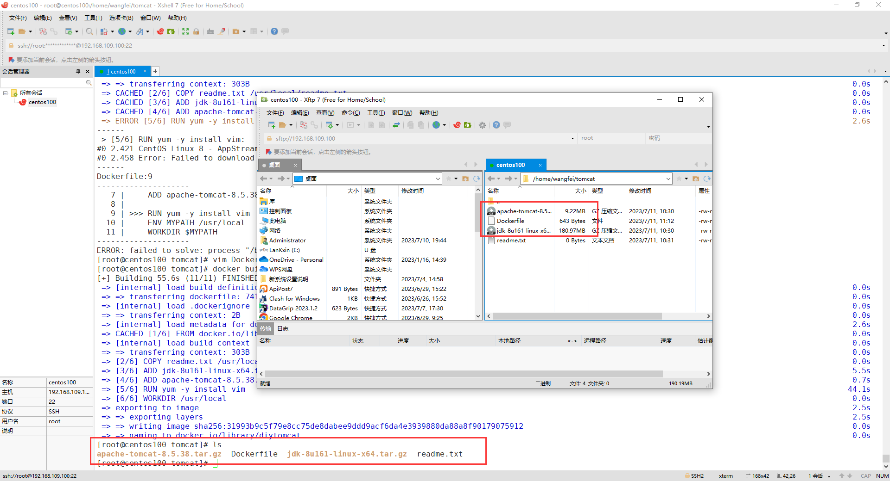

2. 编写dokcerfile文件，官方命名为`Dockerfile`,build会自动寻找这个文件，就不需要-f指定了

   ```shell
   FROM centos:7
   MAINTAINER wangfei<1583729316@qq.com>
   
   COPY readme.txt /usr/local/readme.txt
   
   ADD jdk-8u161-linux-x64.tar.gz /usr/local/
   ADD apache-tomcat-8.5.38.tar.gz /usr/local/
   
   RUN yum -y install vim
   ENV MYPATH /usr/local
   WORKDIR $MYPATH
   
   ENV JAVA_HOME /usr/local/jdk1.8.0_161
   ENV CLASSPATH $JAVA_HOME/lib/lib/dt.jar:$JAVA_HOME/lib/tools.jar
   ENV CATALINA_HOME /usr/local/apache-tomcat-8.5.38
   ENV CATALINA_BASH /usr/local/apache-tomcat-8.5.38
   ENV PATH $PATH:$JAVA_HOME/bin:$CATALINA_HOME/lib:$CATALINA_HOME/bin
   
   EXPOSE 8080
   
   CMD /usr/local/apache-tomcat-8.5.38/bin/startup.sh && tail -F /url/local/apache-tomcat-8.5.38/bin/logs/catalina.out构建镜像 
   ```

3. 构建镜像

   ```shell
   docker build -t diytomcat .
   ```

4. 启动镜像

   ```shell
   docker run -d -p 9090:8080 --name wangfeitomcat -v /home/wangfei/tomcat/test:/usr/local/apache-tomcat-8.5.38/webapps/test -v /home/wangfei/tomcat/tomcatlogs/:/usr/local/apache-tomcat-8.5.38/logs diytomcat
   ```

5. 进入容器

   ```shell
   docker exec -it 2c0632278163 /bin/bash
   ```

6. 测试访问

   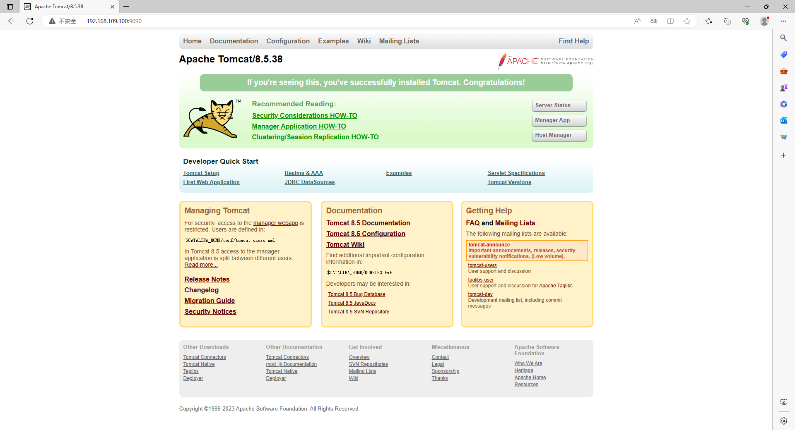

7. 发布项目

   因为做了卷挂载，我们可以直接在本地编写项目就可以发布了

   在本地编写web.xml和index.jsp进行测试

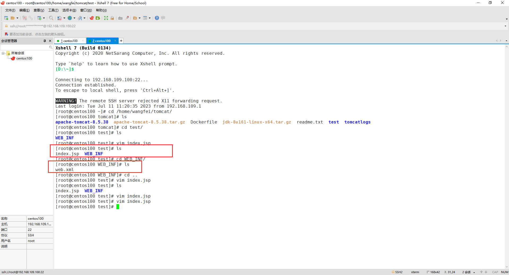

web.xml

```xml
<?xml version="1.0" encoding="UTF-8"?>
<web-app version="2.4" 
    xmlns="http://java.sun.com/xml/ns/j2ee" 
    xmlns:xsi="http://www.w3.org/2001/XMLSchema-instance"
    xsi:schemaLocation="http://java.sun.com/xml/ns/j2ee 
        http://java.sun.com/xml/ns/j2ee/web-app_2_4.xsd">       
</web-app>
```

index.jsp

```jsp
<%@ page language="java" contentType="text/html; charset=UTF-8"
    pageEncoding="UTF-8"%>
<!DOCTYPE html>
<html>
<head>
<meta charset="utf-8">
<title>hello wf</title>
</head>
<body>
Hello World!<br/>
<%
System.out.println("-----my test web logs------");
%>
</body>
</html>
```

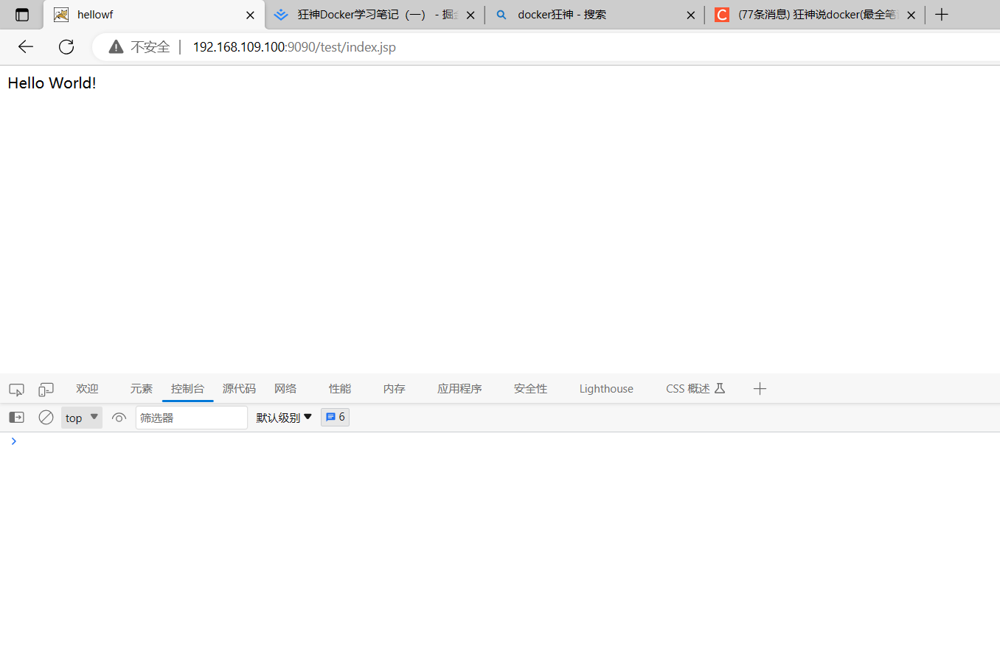


## 13. 镜像上传到阿里云

1. 登录阿里云
2. 打开容器与镜像服务、选择个人版

3. 创建命名空间

4. 创建镜像仓库

5. 在本地虚拟机上登录阿里云，根据操作指南操作

   ```shell
   # 1. 登录阿里云Docker Registry
   $ docker login --username=土豆吃小鸡 registry.cn-qingdao.aliyuncs.com
   # 用于登录的用户名为阿里云账号全名，密码为开通服务时设置的密码。
   
   # 您可以在访问凭证页面修改凭证密码。
   
   # 2. 从Registry中拉取镜像
   $ docker pull registry.cn-qingdao.aliyuncs.com/wangfei0928-test/wangfei-test:[镜像版本号]
   
   # 3. 将镜像推送到Registry
   $ docker login --username=土豆吃小鸡 registry.cn-qingdao.aliyuncs.com
   $ docker tag [ImageId] registry.cn-qingdao.aliyuncs.com/wangfei0928-test/wangfei-test:[镜像版本号]
   $ docker push registry.cn-qingdao.aliyuncs.com/wangfei0928-test/wangfei-test:[镜像版本号]
   # 请根据实际镜像信息替换示例中的[ImageId]和[镜像版本号]参数。
   ```

## 14. Springboot微服务打包Docker镜像

1. 构建springboot项目

2. 打包应用

3. 编写dockerfile

   ```shell
   FROM openjdk:8
   
   COPY *.jar /app.jar
   
   CMD ["--server.port=8080"]
   
   EXPOSE 8080
   
   ENTRYPOINT ["java","-jar","/app.jar"]
   ```

4. 构建镜像

   ```shell
   docker build -t wangfei-dockerdemo .
   ```

5. 发布运行


## 14. Docker网络

弱小和无知不是生存的障碍，傲慢才是。


