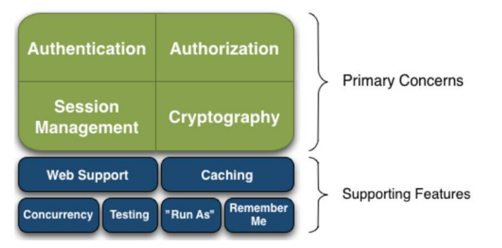
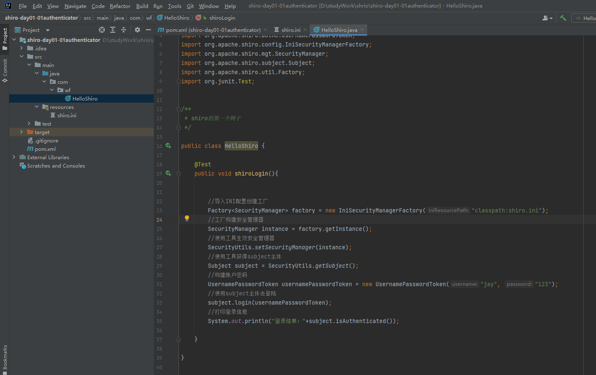

# Shiro

## 1. Shiro是什么？

Shiro是Apache的一个Java安全（权限框架），Shiro可以完成认证、授权、加密、会话管理、与 Web 集成、缓存等。

## 2. Shiro和SpringSecurity对比

1. Spring Security 基于 Spring 开发，项目若使用 Spring 作为基础，配合 Spring  Security 做权限更加方便，而 Shiro 需要和 Spring 进行整合开发；
2.  Spring Security 功能比 Shiro 更加丰富些，例如安全维护方面； 
3. Spring Security 社区资源相对比 Shiro 更加丰富； 
4. Shiro 的配置和使用比较简单，Spring Security 上手复杂些； 
5. Shiro 依赖性低，不需要任何框架和容器，可以独立运行.Spring Security 依赖 Spring 容器;
6. Shiro 不仅仅可以使用在 web 中，它可以工作在任何应用环境中。在集群会话时 Shiro 最重要的一个好处或许就是它的会话是独立于容器的。

## 3. 基本功能点



功能简介  

（1）Authentication：身份认证/登录，验证用户是不是拥有相应的身份； 

（2）Authorization：授权，即权限验证，验证某个已认证的用户是否拥有某个权限；即 判断用 户是否能进行什么操作，如：验证某个用户是否拥有某个角色。或者细粒度的验证 某个用户 对某个资源是否具有某个权限； 

（3）Session Manager：会话管理，即用户登录后就是一次会话，在没有退出之前，它的 所有 信息都在会话中；会话可以是普通 JavaSE 环境，也可以是 Web 环境的； 

（4）Cryptography：加密，保护数据的安全性，如密码加密存储到数据库，而不是明文存 储； 

（5）Web Support：Web 支持，可以非常容易的集成到 Web 环境； 

（6）Caching：缓存，比如用户登录后，其用户信息、拥有的角色/权限不必每次去查，这 样可 以提高效率；

   (7）Concurrency：Shiro 支持多线程应用的并发验证，即如在一个线程中开启另一个线 程，能把权限自动传播过去； 

（8）Testing：提供测试支持； 

（9）Run As：允许一个用户假装为另一个用户（如果他们允许）的身份进行访问；

（10）Remember Me：记住我，这个是非常常见的功能，即一次登录后，下次再来的话不用 登 录了

## 4. Shiro 架构

（1）Subject：应用代码直接交互的对象是 Subject，也就是说 Shiro 的对外 API 核心 就是 Subject。Subject 代表了当前“用户”， 这个用户不一定 是一个具体的人，与当 前应用交互的任何东西都是 Subject，如网络爬虫， 机器人等；与 Subject 的所有交互 都会委托给 SecurityManager； Subject 其实是一个门面，SecurityManager 才是实际的 执行者； 

（2）SecurityManager：安全管理器；即所有与安全有关的操作都会与 SecurityManager  交互；且其管理着所有 Subject；可以看出它是 Shiro 的核心，它负责与 Shiro 的其他 组件进行交互，它相当于 SpringMVC 中 DispatcherServlet 的角色 

（3）Realm：Shiro 从 Realm 获取安全数据（如用户、角色、权限），就是说 SecurityManager 要验证用户身份，那么它需要从 Realm 获取相应的用户 进行比较以确 定用户身份是否合法；也需要从 Realm 得到用户相应的角色/ 权限进行验证用户是否能进 行操作；可以把 Realm 看成 DataSource

## 5. 登录认证基本流程

（1）收集用户身份/凭证，即如用户名/密码 

（2）调用 Subject.login 进行登录，如果失败将得到相应 的 AuthenticationException  异常，根据异常提示用户 错误信息；否则登录成功 

（3）创建自定义的 Realm 类，继承 org.apache.shiro.realm.AuthenticatingRealm类， 实现 doGetAuthenticationInfo() 方法

代码示例：

pom.xml

```xml
	<dependencies>
        <dependency>
            <groupId>commons-logging</groupId>
            <artifactId>commons-logging</artifactId>
            <version>1.1.3</version>
        </dependency>

        <dependency>
            <groupId>org.apache.shiro</groupId>
            <artifactId>shiro-core</artifactId>
            <version>1.3.2</version>
        </dependency>

        <dependency>
            <groupId>junit</groupId>
            <artifactId>junit</artifactId>
            <version>4.11</version>
        </dependency>
    </dependencies>
```

resources资源中添加shiro.ini

```ini
[users]
jay=123
```

```java
public class HelloShiro {
    @Test
    public void shiroLogin(){
        //导入INI配置创建工厂
        Factory<SecurityManager> factory = new IniSecurityManagerFactory("classpath:shiro.ini");
        //工厂构建安全管理器
        SecurityManager instance = factory.getInstance();
        //使用工具生效安全管理器
        SecurityUtils.setSecurityManager(instance);
        //使用工具获得subject主体
        Subject subject = SecurityUtils.getSubject();
        //构建账户密码
        UsernamePasswordToken usernamePasswordToken = new UsernamePasswordToken("jay", "123");
        //使用subject主体去登陆
        subject.login(usernamePasswordToken);
        //打印登录信息
        System.out.println("登录结果："+subject.isAuthenticated());
    }
}
```



## 6. 身份认证流程

（1）首先调用 Subject.login(token) 进行登录，其会自动委托给 SecurityManager  

（2）SecurityManager 负责真正的身份验证逻辑；它会委托给 Authenticator 进行身份验证； 

（3）Authenticator 才是真正的身份验证者，Shiro API 中核心的身份 认证入口点，此 处可以自定义插入自己的实现； 

（4）Authenticator 可能会委托给相应的 AuthenticationStrategy 进行多 Realm 身份 验证，默认ModularRealmAuthenticator 会调用 AuthenticationStrategy 进行多 Realm  身份验证； 

（5） Authenticator 会把相应的 token 传入 Realm，从 Realm 获取身份验证信息，如果没有返回/抛出异常表示身份验证失败了。此处可以配置多个Realm，将按照相应的顺序及策略进行访问。

## 7. 角色、授权

（1）授权，也叫访问控制，即在应用中控制谁访问哪些资源（如访问页面/编辑数据/页面 操作等）。在授权中需了解的几个关键对象：主体（Subject）、资源（Resource）、权限（Permission）、角色（Role）。 

（2）主体(Subject)：访问应用的用户，在 Shiro 中使用 Subject 代表该用户。用户只 有授权 后才允许访问相应的资源。 

（3）资源(Resource)：在应用中用户可以访问的 URL，比如访问 JSP 页面、查看/编辑 某些 数据、访问某个业务方法、打印文本等等都是资源。用户只要授权后才能访问。 

（4）权限(Permission)：安全策略中的原子授权单位，通过权限我们可以表示在应用中 用户 有没有操作某个资源的权力。即权限表示在应用中用户能不能访问某个资源，如：访 问用 户列表页面查看/新增/修改/删除用户数据（即很多时候都是CRUD（增查改删）式权 限控 制）等。权限代表了用户有没有操作某个资源的权利，即反映在某个资源上的操作允 不允 许。 

（5）Shiro 支持粗粒度权限（如用户模块的所有权限）和细粒度权限（操作某个用户的权 限， 即实例级别的） 

（6）角色(Role)：权限的集合，一般情况下会赋予用户角色而不是权限，即这样用户可 以拥有 一组权限，赋予权限时比较方便。典型的如：项目经理、技术总监、CTO、开发工 程师等 都是角色，不同的角色拥有一组不同的权限。


授权的方式有: (1)编程式，通过写if/else代码授权代码块，(2)注解式: `@RequiresRoles("admin")`  (3) JSP标签 `<shiro: hasRole name = "admin">`

## 8. 授权流程

（1）首先调用Subject.isPermitted*/hasRole*接口，其会委托给SecurityManager，而 SecurityManager接着会委托给 Authorizer； 

（2）Authorizer是真正的授权者，如果调用如isPermitted(“user:view”)，其首先会通 过PermissionResolver把字符串转换成相应的Permission实例； 

（3）在进行授权之前，其会调用相应的Realm获取Subject相应的角色/权限用于匹配传入 的角色/权限； 

（4）Authorizer会判断Realm的角色/权限是否和传入的匹配，如果有多个Realm，会委托 给ModularRealmAuthorizer进行循环判断，如果匹配如isPermitted*/hasRole* 会返回 true，否则返回false表示授权失败


权限代码示例：

shiro.ini

```ini
[users]
zhangsan=z3,role1,role2
lisi=l4

[roles]
role1=user:insert,user:select
```

```java
public class HelloShiro {
    @Test
    public void shiroLogin(){
        //导入INI配置创建工厂
        IniSecurityManagerFactory factory = new IniSecurityManagerFactory("classpath:shiro.ini");
        //工厂构建安全管理器
        SecurityManager instance =  factory.getInstance();
        //使用工具生效安全管理器
        SecurityUtils.setSecurityManager(instance);
        //使用工具获得subject主体
        Subject subject = SecurityUtils.getSubject();
        //构建账户密码
        UsernamePasswordToken usernamePasswordToken = new UsernamePasswordToken("zhangsan", "z3");
        //使用subject主体去登陆
        subject.login(usernamePasswordToken);
        //打印登录信息
        System.out.println("登录结果："+subject.isAuthenticated());
        //判断角色
        boolean role1 = subject.hasRole("role1");
        System.out.println("是否有role1:"+role1);
        //判断权限
        boolean permitted = subject.isPermitted("user:insert");
        System.out.println("是否有insert权限："+permitted);
    }
}
```

